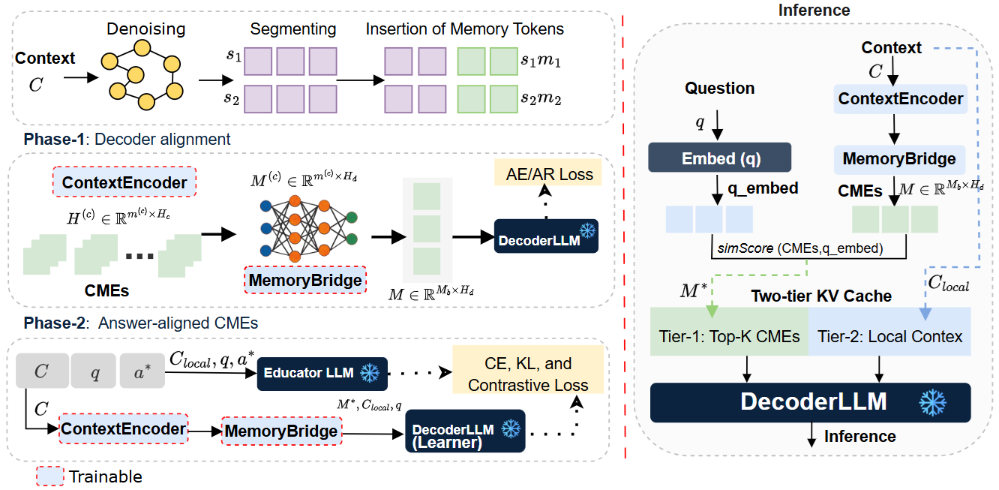

# Compressing Long Context into Answer-Aligned Memory Embeddings for LLM Inference

> Anonymous submission — ACL 2026 review cycle.
> Code and model checkpoints will be released publicly upon acceptance.

---

## Overview

**CMC** (Context to Answer-Aligned Memory Compression) is a soft-compression framework that compresses long input contexts into compact **Context Memory Embeddings (CMEs)** aligned to any frozen decoder's embedding space, enabling efficient LLM inference without modifying decoder weights.

CMC comprises three components:

| Component | Role |
|---|---|
| **ContextEncoder** | Trainable causal LM that produces CMEs via `<MEM>` placeholder tokens after graph-based context denoising |
| **MemoryBridge** | Norm-calibrated two-layer MLP projecting CMEs from encoder space into the frozen decoder's embedding space |
| **Two-tier KV cache** | Tier-1: question-guided top-K CME selection; Tier-2: answer-centred local context window at full token resolution |

Training uses two phases:
- **Phase-1** (Decoder Alignment): AE + AR reconstruction objectives
- **Phase-2** (Answer-Targeted Distillation): CE + KL + contrastive memory-answer alignment using a frozen Educator LLM


Overview of the CMC framework: ($i$) context denoising and chunked compression via ContextEncoder, $ii$) cross-architecture projection via MemoryBridge, and ($iii$) two-tier KV cache inference via DecoderLLM with question-guided Tier-1 CME selection and Tier-2 local window.

---

## Repository Structure

```
.
├── cmc/
│   ├── __init__.py        # Public API
│   ├── config.py          # CMCConfig dataclass (all hyperparameters)
│   ├── models.py          # MemoryBridge module
│   ├── compression.py     # Graph denoising, chunking, CME extraction, KV cropping
│   ├── training.py        # Phase-1 and Phase-2 loss functions
│   ├── evaluation.py      # EM/F1 metrics and generation
│   ├── utils.py           # Checkpointing, timing hooks, data helpers
│   └── efficiency.py      # Analytical MACs and KV-cache estimates
├── train.py               # Main training + evaluation entry point
├── requirements.txt
└── README.md
```

---

## Requirements

```bash
pip install -r requirements.txt
```

Model access requires a HuggingFace account with access to:
- `meta-llama/Meta-Llama-3-8B-Instruct`
- `mistralai/Mistral-7B-Instruct-v0.3`
- `google/gemma-2-9b-it`

Set your token: `huggingface-cli login`

---

## Hardware

All experiments in the paper were run on **NVIDIA A100 80 GB** GPU.
Training one epoch with the full SQuAD split (86k examples, GPT2-Large + Llama-3-8B) takes approximately **X hours** on an A100.

---

## Quick Start

### Train with default settings (SQuAD, GPT2-Large + Llama-3-8B)

```bash
python train.py
```

### Custom encoder / decoder pair

```bash
python train.py \
    --compressor_model facebook/opt-1.3b \
    --decoder_model mistralai/Mistral-7B-Instruct-v0.3 \
    --checkpoint_dir checkpoints/opt1.3b_mistral
```

### Adjust compression rate or training size

```bash
python train.py --comp_rate 8 --train_samples 10000 --val_samples 1000
```

All CMCConfig fields are available as command-line arguments.

---

## Key Hyperparameters

| Parameter | Default | Description |
|---|---|---|
| `comp_rate` | 4 | Compression rate r = t / m (chunk tokens / memory tokens) |
| `chunk_tokens` | 256 | Segment length t |
| `tau` | 0.05 | Graph denoising threshold τ |
| `distant_top_k` | 30 | Tier-1 top-K CMEs |
| `local_window` | 130 | Tier-2 local window W (tokens) |
| `qa_kd_steps_per_epoch` | 800 | Phase-2 KD steps per epoch |
| `kd_weight_kl` | 0.5 | KL divergence loss weight λ_KL |
| `kd_weight_ctr` | 0.1 | Contrastive loss weight λ_CL |

Full hyperparameter documentation is in `cmc/config.py`.

---

## Reproducing Paper Results

The paper evaluates nine encoder-decoder combinations across four QA benchmarks under two data settings. The controlled-data setting uses 10,000 training samples; the full-data setting uses the complete SQuAD / AdversarialQA / HotpotQA splits.

**Controlled-data (SQuAD, GPT2-Large + Llama):**
```bash
python train.py \
    --train_samples 10000 \
    --val_samples 1000 \
    --checkpoint_dir checkpoints/controlled_llama
```

**Full-data (SQuAD, GPT2-Large + Llama):**
```bash
python train.py \
    --train_samples 86000 \
    --val_samples 6000 \
    --checkpoint_dir checkpoints/full_llama
```

---

## Datasets

All datasets are loaded automatically via the HuggingFace `datasets` library:

| Dataset | License | Split used |
|---|---|---|
| SQuAD | CC BY-SA 4.0 | train / validation |
| AdversarialQA | Apache 2.0 | train / validation |
| HotpotQA | CC BY-SA 4.0 | train / validation |
| CovidQA | Apache 2.0 | train / validation |

---

## Checkpoint Format

Saved checkpoints contain:

```
checkpoint_dir/
    compressor/          # ContextEncoder weights + tokenizer
    memory_bridge.pt     # MemoryBridge state_dict
    cmc_config.json      # Inference-time hyperparameters
```

---

## License

This code is released for research purposes under the MIT License.
